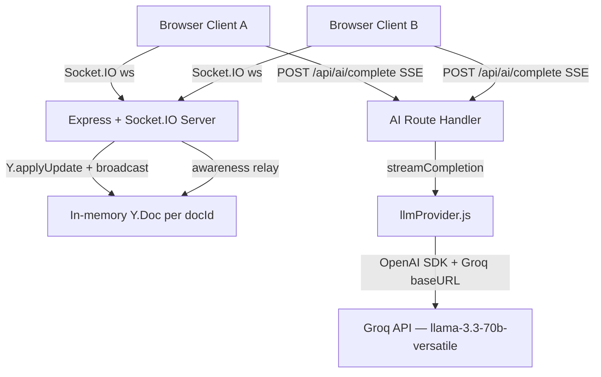

# Real-Time AI-Powered Collaborative Text Editor

## Overview

A browser-based collaborative text editor that synchronizes document state across multiple clients using Yjs CRDTs over Socket.IO. It integrates Groq's LLM API (llama-3.3-70b-versatile) to provide inline ghost-text completions, slash command AI actions, and streaming AI responses — all without writing AI output into the collaboration state until the user explicitly accepts it.

## Architecture



**Yjs/Socket.IO bridge decision.** The sync layer is a thin relay: the server holds one `Y.Doc` per `documentId`, decodes incoming base64 Yjs updates, applies them to the server-side doc to maintain authoritative state, and broadcasts the same encoded payload to all other sockets in the room. No re-encoding occurs — the server is a pure CRDT relay plus persistent state holder. A custom symbol (`NETWORK_ORIGIN`) is used as the Yjs transaction origin on the client to detect updates that came from the network and skip re-emitting them, preventing echo loops. Third-party Yjs-socket.io packages were evaluated and skipped: the protocol is 40 lines and easier to audit than an unverified npm package.

**Ghost text as ephemeral state.** AI completions are held in local React state as a ProseMirror decoration widget, not written into the shared Yjs document. This means other clients never see an in-progress suggestion, and the user retains full accept/reject control. Only a Tab keypress commits the text into the Yjs doc (wrapped in the `aiSuggestion` mark), at which point it enters the CRDT and propagates normally. Escape or any printable key clears the decoration with no document mutation.

## Setup

```bash
git clone https://github.com/Rushikesh-5706/Real-Time-AI-Powered-Collaborative-Text-Editor-with-Yjs-and-WebSockets.git
cd Real-Time-AI-Powered-Collaborative-Text-Editor-with-Yjs-and-WebSockets

cp .env.example .env
# Edit .env and set LLM_API_KEY to your Groq API key

docker-compose up --build
```

Frontend: http://localhost:3000
Backend health: http://localhost:3001/health

## Environment Variables

| Variable | Required | Description |
|---|---|---|
| `PORT` | No (default: 3001) | Port the backend server listens on |
| `VITE_BACKEND_URL` | No (default: http://localhost:3001) | Backend URL the frontend connects to |
| `LLM_API_KEY` | **Required** | Groq API key from console.groq.com |
| `LLM_MODEL` | No (default: llama-3.3-70b-versatile) | Groq model identifier |
| `LLM_REQUEST_TIMEOUT_MS` | No (default: 15000) | Milliseconds before aborting an LLM request |

## API Reference

### POST /api/ai/complete

Streams AI-generated text via Server-Sent Events.

**Request body:**

| Field | Type | Required | Description |
|---|---|---|---|
| `documentContent` | string | Yes | Full text of the current document |
| `cursorPosition` | number | Yes | Cursor position as a character offset |
| `precedingText` | string | No | Text from document start to cursor |
| `followingText` | string | No | Text from cursor to document end |
| `intent` | string | Yes | One of the supported intent values below |
| `selectedText` | string \| null | No | Currently selected text, if any |

**Supported intents:**

| Intent | Behavior |
|---|---|
| `continue_paragraph` | Continues the text naturally from `precedingText` |
| `rewrite_selection` | Rewrites `selectedText`, outputs replacement only |
| `expand` | Expands `precedingText` with more detail |
| `summarise` | Produces a concise summary of `precedingText` |
| `todo` | Converts content into a markdown checklist |
| `translate` | Translates content to Hindi (default target language) |

**Response:** `Content-Type: text/event-stream`, each event is `data: {"token": "..."}`, terminated by `data: [DONE]`. Errors are sent as `data: {"error": "..."}` followed by `data: [DONE]`.

## Testing

**Backend tests (Jest):**

```bash
cd backend
npm install
# Unit/integration tests — no live API needed for prompt routing tests
node --experimental-vm-modules node_modules/.bin/jest ../../tests/backend/ --testEnvironment=node

# With live AI streaming tests:
BACKEND_URL=http://localhost:3001 RUN_LIVE_AI_TESTS=true node --experimental-vm-modules node_modules/.bin/jest ../../tests/backend/ --testEnvironment=node
```

Backend test coverage:
- `collaboration.sync.test.js` — two real socket.io-client instances verify CRDT relay and awareness relay
- `aiComplete.streaming.test.js` — prompt template routing produces distinct prompts; optional live streaming asserts chunked SSE delivery

**E2E tests (Playwright):**

```bash
cd frontend
npm install
npx playwright install chromium

# Requires both backend and frontend running
FRONTEND_URL=http://localhost:3000 npx playwright test ../../tests/e2e/ --reporter=list
```

E2E coverage:
- `presence.spec.js` — cursor data-testids appear across browser contexts
- `ghostText.spec.js` — ghost text appears, grows incrementally, Tab/Escape/type-over all work
- `slashCommands.spec.js` — slash menu appears with all five commands
- `panels.spec.js` — stats start at 0 and increment, context intent/chars update, summarise inserts accepted span

## Known Limitations

- Document state is in-memory. All content is lost on server restart — no database persistence.
- No authentication. Any browser connecting to the server can read and edit the shared document.
- Single document only (`main-doc`). There is no UI for creating or switching between multiple documents.
- Rate limiting from Groq's free tier may cause AI completions to fail temporarily during heavy usage. The app returns a clear error message and recovers on the next request.
